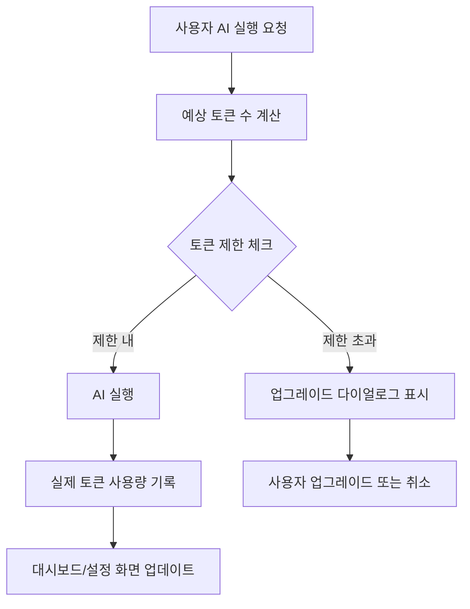

# AI 실행 토큰 연동 구현 완료

## 개요
AI 실행 시 토큰 사용량을 체크하고 기록하는 시스템을 구현했습니다. 무료 사용자의 경우 월 10,000 토큰 제한이 적용되며, 초과 시 업그레이드 다이얼로그가 표시됩니다.

---

## 구현된 기능

### 1. 토큰 사용 흐름



### 2. 구현된 파일

#### 생성된 파일
- `src/components/dialogs/UpgradeDialog.tsx` - 업그레이드 안내 다이얼로그

#### 수정된 파일
- `src/hooks/useExecuteAI.ts` - 토큰 체크 및 기록 로직 추가
- `src/pages/AIExecute.tsx` - 업그레이드 다이얼로그 연동

---

## 상세 구현

### 1. useExecuteAI Hook 개선

**주요 변경사항**:
```typescript
// 실행 전: 예상 토큰 수 계산
const estimatedInputTokens = Math.ceil(params.prompt.length / 3);
const estimatedOutputTokens = 500;
const estimatedTotalTokens = estimatedInputTokens + estimatedOutputTokens;

// 토큰 제한 체크
const limitCheck = await checkTokenLimit.mutateAsync(estimatedTotalTokens);

if (!limitCheck.allowed) {
  throw new Error('TOKEN_LIMIT_EXCEEDED');
}

// 실행 후: 실제 토큰 사용량 기록
if (data.tokenUsage?.total_tokens) {
  await incrementTokenUsage.mutateAsync(data.tokenUsage.total_tokens);
}
```

**토큰 계산 방식**:
- 한글: 1 토큰 ≈ 2-3자
- 영어: 1 토큰 ≈ 4자
- 예상 출력: 500 토큰 (평균 가정)

### 2. UpgradeDialog 컴포넌트

**기능**:
- 토큰 제한 초과 시 표시
- Pro/Enterprise 플랜 비교
- "사용량 상세 보기" 버튼 (설정 페이지로 이동)
- "나중에" 버튼 (다이얼로그 닫기)

**Props**:
```typescript
interface UpgradeDialogProps {
  open: boolean;
  onOpenChange: (open: boolean) => void;
  reason?: "limit_exceeded" | "low_tokens" | "general";
}
```

**표시 조건**:
- `limit_exceeded`: 토큰 소진 (100%)
- `low_tokens`: 토큰 부족 (80% 이상)
- `general`: 일반 업그레이드 권장

### 3. AIExecute 페이지 연동

**에러 처리**:
```typescript
try {
  const response = await executeAI.mutateAsync({ ... });
  // 성공 처리
} catch (error: any) {
  // 토큰 제한 초과 시 업그레이드 다이얼로그 표시
  if (error.message === 'TOKEN_LIMIT_EXCEEDED') {
    setIsUpgradeDialogOpen(true);
    return;
  }
  // 기타 에러 처리
  toast.error('AI 실행 실패', { ... });
}
```

---

## 사용자 경험 (UX)

### 정상 실행 시
1. 사용자가 프롬프트 입력 후 "실행" 버튼 클릭
2. 토큰 체크 (백그라운드, 사용자에게 보이지 않음)
3. AI 실행 및 결과 표시
4. 토큰 사용량 자동 기록
5. 대시보드/설정 화면에 실시간 반영

### 토큰 제한 초과 시
1. 사용자가 프롬프트 입력 후 "실행" 버튼 클릭
2. 토큰 체크 → 제한 초과 감지
3. **업그레이드 다이얼로그 표시**
   - 현재 사용량 표시 (100%)
   - Pro/Enterprise 플랜 비교
   - "Pro로 업그레이드" 버튼
   - "문의하기" 버튼 (Enterprise)
   - "사용량 상세 보기" 버튼
   - "나중에" 버튼
4. AI 실행 차단 (토큰 낭비 방지)

---

## 토큰 사용량 추적

### 실시간 업데이트
- AI 실행 완료 시 즉시 토큰 사용량 증가
- React Query 캐시 무효화로 자동 새로고침
- 대시보드 위젯, 설정 페이지 동시 업데이트

### 표시 위치
1. **대시보드** (TokenUsageWidget)
   - 이번 달 사용량
   - 프로그레스 바
   - 남은 토큰 수
   - 경고 배지 (80% 이상)

2. **설정 > 사용량 탭** (TokenUsageSection)
   - 상세 사용량
   - 다음 리셋 날짜
   - 업그레이드 카드
   - 토큰 절약 팁

3. **AI 실행 화면**
   - 실행 후 사용 토큰 표시
   - 예: "토큰: 1,234 (입력: 234, 출력: 1,000)"

---

## 데이터베이스 연동

### 토큰 체크 (실행 전)
```sql
SELECT * FROM check_token_limit(
  p_user_id := '...',
  p_required_tokens := 700
);

-- 반환값:
{
  "allowed": true/false,
  "current_usage": 2450,
  "limit": 10000,
  "remaining": 7550
}
```

### 토큰 기록 (실행 후)
```sql
SELECT * FROM increment_token_usage(
  p_user_id := '...',
  p_tokens_used := 650
);

-- 반환값:
{
  "success": true,
  "current_usage": 3100,
  "limit": 10000,
  "remaining": 6900
}
```

---

## 테스트 시나리오

### 시나리오 1: 정상 실행 (무료 사용자)
```
초기 상태: 2,000 / 10,000 토큰 사용

1. AI 실행 (예상 500 토큰)
   → 체크: 2,000 + 500 = 2,500 < 10,000 ✅

2. AI 응답 생성 (실제 650 토큰)
   → 기록: 2,000 + 650 = 2,650 토큰

3. 대시보드 업데이트
   → 2,650 / 10,000 (26.5%)
```

### 시나리오 2: 토큰 제한 초과
```
초기 상태: 9,800 / 10,000 토큰 사용 (98%)

1. AI 실행 시도 (예상 500 토큰)
   → 체크: 9,800 + 500 = 10,300 > 10,000 ❌

2. 토큰 제한 초과 감지
   → AI 실행 차단
   → 업그레이드 다이얼로그 표시

3. 사용자 선택
   → Pro 업그레이드 또는
   → 나중에 (다이얼로그 닫기)
```

### 시나리오 3: Pro 사용자
```
초기 상태: 45,000 / 100,000 토큰 (Pro)

1. AI 실행 (예상 500 토큰)
   → 체크: 45,000 + 500 < 100,000 ✅

2. AI 응답 생성 및 기록
   → 45,650 / 100,000 (45.65%)

3. 제한 걱정 없이 계속 사용 가능
```

### 시나리오 4: Enterprise 사용자 (무제한)
```
초기 상태: 150,000 토큰 사용 (무제한)

1. AI 실행
   → 체크: 무제한 (항상 통과) ✅

2. AI 응답 생성 및 기록
   → 151,000 토큰 (기록만, 제한 없음)

3. "무제한" 배지 표시
```

---

## 에러 처리

### 토큰 체크 실패
- 네트워크 오류 등으로 체크 실패 시
- 경고 로그만 출력하고 실행 계속 진행
- 서비스 연속성 우선

### 토큰 기록 실패
- 실행 후 기록 실패 시
- 에러 로그 출력하지만 사용자에게는 성공 표시
- 다음 실행 시 누적 기록 가능

### 토큰 제한 초과
- 명확한 에러 메시지
- 업그레이드 다이얼로그 표시
- AI 실행 차단 (비용 절감)

---

## 빌드 상태

✅ **빌드 성공** (1.92s)
- 총 3026개 모듈
- CSS: 107.15 kB
- JS: 1,282.31 kB

---

## 다음 단계 (선택사항)

### 1. Edge Function 수정
현재는 프론트엔드에서만 토큰을 추적합니다. 더 정확한 추적을 위해 Edge Function 수정:

```typescript
// supabase/functions/execute-ai/index.ts

// AI 실행 전 토큰 체크
const { data: limitCheck } = await supabase.rpc('check_token_limit', {
  p_user_id: userId,
  p_required_tokens: estimatedTokens
});

if (!limitCheck.allowed) {
  return new Response(JSON.stringify({
    success: false,
    error: 'TOKEN_LIMIT_EXCEEDED'
  }), { status: 403 });
}

// AI 실행 후 토큰 기록
await supabase.rpc('increment_token_usage', {
  p_user_id: userId,
  p_tokens_used: response.usage.total_tokens
});
```

### 2. 월간 자동 리셋
Supabase Cron 또는 Edge Function Cron으로 매월 1일 자동 리셋:

```sql
SELECT cron.schedule(
  'monthly-token-reset',
  '0 0 1 * *',
  $$
    UPDATE profiles
    SET
      tokens_used_this_month = 0,
      tokens_reset_at = DATE_TRUNC('month', NOW() + INTERVAL '1 month')
    WHERE tokens_reset_at <= NOW();
  $$
);
```

### 3. 이메일 알림
80%, 100% 도달 시 이메일 알림 발송

### 4. 토큰 사용 통계
- 월별/주별 사용량 차트
- AI 모델별 사용량 분석
- 가장 많이 사용한 프롬프트 TOP 10

---

## 마이그레이션 확인

토큰 관리를 위해 다음 마이그레이션이 필요합니다:

```bash
# 1. AI 설정 마이그레이션
# supabase/migrations/20251225000001_add_user_preferences.sql

# 2. 토큰 관리 마이그레이션 (필수!)
# supabase/migrations/20251225000002_add_token_management.sql
```

Supabase Dashboard에서 두 마이그레이션을 모두 실행하세요.

---

**작성일**: 2025-12-25
**버전**: 1.0
**상태**: 구현 완료, 테스트 준비
